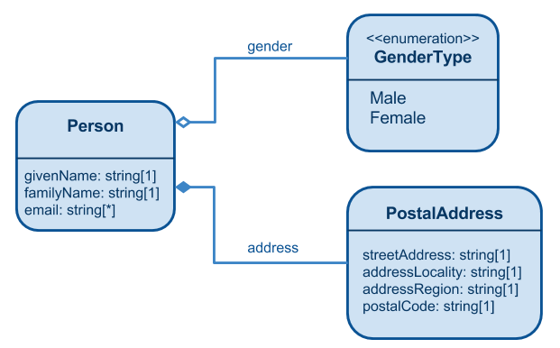

# Basic Workbook
This example shows how you can use a spreadsheet to design a very simple
semantic model corresponding to the following ULM class diagram:



Recall that a semantic model has five elements:

1. A collection of ontologies that organize the other elements of the semantic model into distinct namespaces.
2. A collection of classes that describe the types of entities within your domain.
3. A collection of properties that describe the fields that a given entity may have and the relationships between entities.
4. A collection of individual instances of some classes.  Individual instances are used mostly to define reference data.
5. A collection of data shapes that express the ways in which a given type of entity can be represented either in flight or at rest.

In this example, we take a shortcut and omit explicit definitions of the *classes* and
*properties* because they can be inferred from the definitions of the
*individuals* and *shapes*.

In general, it is a best practice to define classes and properties explicitly,
but it is reasonable to omit them when you are just getting started.  We'll show
how to model classes and properties in the advanced workbook example.

# Prerequisites
Make sure you have installed Maven and Git.  See [Getting Started](../README.md#GetStarted) for details.

You should have a basic understanding of RDF, SHACL Data Shapes, and the Turtle
serialization format as discussed in the following articles:
   * [RDF in a nutshell](http://developers.konig.io/docs/RDF_in_a_nutshell/)
   * [SHACL Basics](http://kcoyle.blogspot.com/2015/10/shacl-shapes-constraint-language.html)
   * [Graph Serialization](http://developers.konig.io/docs/Graph_Serialization/)

# Procedure

There are three main steps to produce a semantic model:

1. Create a workbook containing a description of your model.
2. Create a Maven project that will transform your spreadsheet into a collection of OWL and SHACL statements.
3. Run Maven to generate OWL and SHACL statements from your spreadsheet.

We discuss these steps in detail below.

## Create a Workbook
For this example, we used Google Sheets to create a workbook and then downloaded
it in Microsoft Excel (xlsx) format.

You can view the [original workbook](https://goo.gl/oP6auN) in Google Drive.

You can access the [downloaded workbook](src/basic-workbook.xlsx) in this Github repository.

There are three sheets in the workbook:

* Ontologies
* Individuals
* Property Constraints

We discuss these sheets below.

### Ontologies

The Ontologies sheet contains information about the ontologies used in our semantic model.

Each ontology has the following attributes:

| Attribute          | Description                                             |
|--------------------|---------------------------------------------------------|
| Ontology Name      | A human-friendly name for the ontology suitable for display in a user interface |
| Comment            | A comment that describes the purpose or scope of the ontology  |
| Namespace URI      | A namespace for entities contained within the ontology |
| Prefix             | A short prefix that can be used to define [compact URI](https://en.wikipedia.org/wiki/CURIE) values for entities within the ontology |

The primary ontology in our model is the [Schema.org](http://schema.org/)
ontology. It has the following attributes:

| Attribute          | Value                                                    |
|--------------------|----------------------------------------------------------|
| Ontology Name      | Schema.org                                               |
| Comment            | An ontology developed by Google, Yahoo!, Microsoft and others to describe people, places, and things commonly found on the web.|
| Namespace URI      | http://schema.org/                                       |
| Prefix             | schema                                                   |

We also define a separate ontology for the data shapes.  

When you run the Maven build, information from the Ontologies sheet will be transformed
into the OWL statements shown below.

File: `/target/generated/src/rdf/owl/schema.ttl`

```
schema: a owl:Ontology ;
	vann:preferredNamespacePrefix "schema" ;
	rdfs:label "Schema.org" ;
	rdfs:comment """
     An ontology developed by Google, Yahoo!, Microsoft and others to describe
     people, places, and things commonly found on the web.""" .
```


File: `/target/generated/src/rdf/owl/shapeNamespaces.ttl`

```
schema1: a owl:Ontology ;
	vann:preferredNamespacePrefix "schema1" ;
	rdfs:label "Schema.org Shapes (version 1)" ;
	rdfs:comment "A namespace for Schema.org data shapes (version 1)" .
```

The Maven plugin that parses the spreadsheet comes with several ontologies
pre-defined by default.  You don't need to provide a definition for these
ontologies.

The following table shows the Ontologies that are pre-defined.

| Prefix         |  Namespace URI                                               |
|----------------|--------------------------------------------------------------|
| konig          | http://www.konig.io/ns/core/                                 |
| owl            | http://www.w3.org/2002/07/owl#                               |
| rdf            | http://www.w3.org/1999/02/22-rdf-syntax-ns#                  |
| rdfs           | http://www.w3.org/2000/01/rdf-schema#                        |
| sh             | http://www.w3.org/ns/shacl#                                  |
| vann           | http://purl.org/vocab/vann/                                  |
| xsd            | http://www.w3.org/2001/XMLSchema#                            |


### Individuals
Individuals represent enumerated values.

Our example includes enumerated values that provide a controlled vocabulary
for a person's gender.  There are two values in this controlled vocabulary:
"Female" and "Male".

When you run the Maven build, the information from the Individuals sheet will
be transformed into the OWL statements shown below.

File: `/target/generated/src/rdf/owl/schema.ttl`

```
schema:GenderType a owl:Class ;
	rdfs:subClassOf schema:Enumeration .

schema:Female a schema:Enumeration , schema:GenderType ;
	schema:name "Female" ;
	rdfs:comment "The female gender" .

schema:Male a schema:Enumeration , schema:GenderType ;
	schema:name "Male" ;
	rdfs:comment "The male gender" .
```

### Property Constraints

The meat of the semantic model is contained in the Property Constraints sheet.
For each data shape, this sheet describes constraints on the properties included in
the given shape.

A property can have four main kinds of constraints:

| Constraint                | Description                                       |
|---------------------------|---------------------------------------------------|
| Value Type                |  The expected type of value for the property.  This can be one of the [built-in datatypes](https://www.w3.org/TR/xmlschema-2/#built-in-datatypes) from XML Schema (`xsd:boolean`, `xsd:string`, `xsd:int`, etc.) or a reference to some  data shape if the value is an embedded record |
| Min Count                 | The minimum number of values expected for the property.  If the property is optional, you should set `Min Count` equal to `0`.  If the property is required (i.e. must have a value), then you would ordinarily set `Min Count` equals to `1`.  You can set it to a larger value if there is a requirement for a specific number of values to be supplied, but that's an unusual circumstance. |
| Max Count                 | The maximum number of values expected for the property.  For single-valued properties, you should set `Max Count` equal to `1`.  For multi-valued properties, you would ordinarily set `Max Count` equal to the string "unbounded".  But you can set it to any positive integer. |
| Value Class               | This constraint is used when the property describes a relationship to some target entity.  The value is a compact URI (CURIE) that identifies the related entity |

There are other kinds of constraints, but these are the only ones used in our example.

#### Datatype Properties

A Datatype Property is a property whose value is a primitive datatype (string,
boolean, integer, etc.).

In this case, the `Value Type` should be one of the
[built-in datatypes](https://www.w3.org/TR/xmlschema-2/#built-in-datatypes) from the
XML Schema standard.

For an example that illustrates this usage pattern, see Row 3 in the
[Property Constraints](https://goo.gl/jV8ctQ) sheet.  That row contains the following
data:

| Column           | Value                                                      |
|------------------|------------------------------------------------------------|
| Shape Id         | schema1:PersonShape                                        |
| Property Id      | schema:givenName                                           |
| Comment          | Given name. In the U.S., the first name of a Person.       |
| Value Type       | xsd:string                                                 |
| Min Count        | 1                                                          |
| Max Count        | 1                                                          |

In plain English, this information tells us...

> Any resource that conforms to `schema1:PersonShape` MUST have a property
> named `schema:givenName` that records the person's first name. The
> value of this property is a string.

When you run the Maven build, this information will be translated into the
following SHACL statements:

File: `/target/generated/src/rdf/shapes/schema1_PersonShape.ttl`

```
schema1:PersonShape
  sh:property [
		sh:predicate schema:givenName ;
		rdfs:comment "Given name. In the U.S., the first name of a Person." ;
		sh:datatype xsd:string ;
		sh:minCount 1 ;
		sh:maxCount 1
  ] .
```

#### Object Properties

An Object Property is a property whose value is some object (as opposed to a primitive
datatype).  In other words, an Object Property expresses a relationship between two things.
When designing a data shape, you must choose whether to express the relationship with
 a URI reference or an embedded record.

In the first case (URI reference), you should set the `Value Type` to `xsd:anyURI`
and set the `Value Class` to the CURIE that identifies the type of entity being
referenced.  

For an example that illustrates this usage pattern, see Row 7 in the
[Property Constraints](https://goo.gl/jV8ctQ) sheet.  That row contains the following
data:

| Column           | Value                                                      |
|------------------|------------------------------------------------------------|
| Shape Id         | schema1:PersonShape                                        |
| Property Id      | schema:gender                                              |
| Comment          | Gender of the person.                                      |
| Value Type       | xsd:anyURI                                                 |
| Min Count        | 0                                                          |
| Max Count        | 1                                                          |
| Value Class      | schema:GenderType                                          |

In plain English, this information tells us...

> Any resource that conforms to `schema1:PersonShape` may have a property
> named `schema:gender` that records the person's Gender.  The value of this
> property is a URI reference to an instance of the class `schema:GenderType`.

When you run the Maven build, this information will be translated into the
following SHACL statements:

File: `/target/generated/src/rdf/shapes/schema1_PersonShape.ttl`

```
schema1:PersonShape
  sh:property [
		sh:predicate schema:gender ;
		rdfs:comment "Gender of the person." ;
		sh:class schema:GenderType ;
		sh:nodeKind sh:IRI ;
		sh:minCount 0 ;
		sh:maxCount 1
  ] .
```

You don't have to express an object relationship by URI reference.  You could, instead,
specify an embedded record of the related entity. In this case, you set the `Value Type`
equal to a CURIE that names the Shape of the embedded record.

For an example that illustrates this usage pattern, see Row 6 in the
[Property Constraints](https://goo.gl/jV8ctQ) sheet.  That row contains the following
data:

| Column           | Value                                                      |
|------------------|------------------------------------------------------------|
| Shape Id         | schema1:PersonShape                                        |
| Property Id      | schema:address                                             |
| Comment          | The person's postal address                                |
| Value Type       | schema1:PostalAddressShape                                 |
| Min Count        | 0                                                          |
| Max Count        | 1                                                          |
| Value Class      | schema:PostalAddress                                       |

In plain English, this information tells us...

> Any resource that conforms to `schema1:PersonShape` may have a property
> named `schema:address` that records the person's postal address.  The value
> of this property is an embedded record that conforms to `schema1:PostalAddressShape`.

When you run the Maven build, this information will be translated into the
following SHACL statements:

File: `/target/generated/src/rdf/shapes/schema1_PersonShape.ttl`

```
schema1:PersonShape
  sh:property [
		sh:predicate schema:address ;
		rdfs:comment "The person's postal address." ;
		sh:shape schema1:PostalAddressShape ;
		sh:minCount 0 ;
		sh:maxCount 1
	 ] .
```

The property constraints for `schema1:PostalAddressShape` are contained in
Rows 8-11.

Notice that we have specified the type of embedded entity in the `Value Class`
column.  In particular, the `Value Class` is defined to be `schema:PostalAddress`.

We should remind you about the difference between an OWL Class and
a data Shape.  An OWL Class is an somewhat abstract thing that describes an entity
without regard to the way we will represent that entity either in flight or at rest.
The OWL description tells you all the known properties that COULD be used
in a representation of resource of the given type.

By contrast, a data Shape is more concrete.  It tells you exactly which properties
MAY (or MUST) be included in a given representation.  

If you look up the official documentation for
the [PostalAddress](http://schema.org/PostalAddress) Class, you will see a large number
of available properties: addressCountry, addressLocality, addressRegion, postOfficeBoxNumber,
postalCode, streetAddress, areaServed, availableLanguage, contactOption, contactType, email,
faxNumber, hoursAvailable, productSupported, telephone, additionalType, alternateName, description,
disambigbuatingDescription, image, mainEntityOfPage, name, potentialAction, sameAs, url.

When we define `schema1:PostalAddressShape`, we choose a subset
of properties that MUST be included in this particular representation of the `PostalAddress`
class: streetAddress, addressLocality, addressRegion, and postalCode.

Strictly speaking, it is not necessary to specify the `Value Class` constraint for
an object property whose value is an embedded record. There are other ways to define the
target class for the embedded resource.  For more information about these alternatives,
see

1. The [discussion](#targetClassFromKonigId) about `Value Class` and the `konig:id` pseudo-property, or
2. Explicit definition of the `Target Class`. This topic is covered in the advanced workbook example. (TODO: Add a link)

#### IRI Identifiers

Any resource within the semantic web may be identified by an IRI (an internationalized
version of a URI). Technically, the IRI identifier is NOT an `rdf:Property`.  This might
seem strange.  In most modeling languages, identifiers are properties just like any
other attribute of a resource.  But in RDF, the identifier for a resource is distinguished
from other attributes because it is used to represent the resource as a whole.

Nevertheless, when defining a semantic model it is convenient to *think* of the IRI
identifier as if it were just another property.  To that end, the Konig vocabulary
introduces a *pseudo-property* named `konig:id` which represents the IRI identifier.

Row 2 in the [Property Constraints](https://goo.gl/jV8ctQ) sheet shows how
`konig:id` is used.  That row contains the following data:

| Column           | Value                                                      |
|------------------|------------------------------------------------------------|
| Shape Id         | schema1:PersonShape                                        |
| Property Id      | konig:id                                                   |
| Comment          | A URI that identifies the Person.                          |
| Value Type       | xsd:anyURI                                                 |
| Min Count        | 1                                                          |
| Max Count        | 1                                                          |
| Value Class      | schema:Person                                              |

In plain English, this information tells us...

> Any resource that conforms to `schema1:PersonShape` must be identified by an
> IRI. Moreover, individuals of this shape are always instances of the
> `schema:Person` class.

When you run the Maven build, this information will be translated into the
following SHACL statements:

File: `/target/generated/src/rdf/shapes/schema1_PersonShape.ttl`

```
schema1:PersonShape a sh:Shape ;
  sh:targetClass schema:Person ;
  sh:nodeKind sh:IRI ;
  ...
```

There are several points worth mentioning.

First, there is no SHACL PropertyConstraint for the `konig:id` property.
This is why we describe it as a *pseudo-property*.

<a name="targetClassFromKonigId"></a>Second, the `Value Class` of the `konig:id`
pseudo-property is interpreted as the `sh:targetClass` of the
parent Shape (in this case `schema1:PersonShape`).

Third, the cardinality constraints dictate the value of the `sh:nodeKind` property
in accordance with the following possible configurations.

|  Min Count   |  Max Count   | sh:nodeKind              |
|--------------|--------------|--------------------------|
| 0            |  0           | sh:BlankNode             |
| 0            |  1           | sh:BlankNodeOrIRI        |
| 1            |  1           | sh:IRI                   |  

## Create a Maven project

Once you have defined your semantic model in a spreadsheet, you need to create
a Maven project that will parse the spreadsheet and describe the model using the
W3C [OWL](https://www.w3.org/TR/owl2-overview/) and [SHACL](https://www.w3.org/TR/shacl/) standards.

This Github repository contains the Maven project for our example.
Here's the layout of the project:

```
  |-- images
  |-- src
  |   |-- assembly
  |   |   `-- dep.xml
  |   |-- basic-workbook.xlsx
  |-- pom.xml
  |-- README.md

```

The main elements are the Maven `pom.xml` file, and the workbook source file
(`basic-workbook.xlsx`).

The `README.md` file is what you are reading now.

The `images` directory contains images that appear in the README.

The Maven pom file contains two key plugins:

 * konig-schemagen-maven-plugin
 * maven-assembly-plugin

The `konig-schemagen-maven-plugin` is responsible for parsing the workbook and
generating the OWL and SHACL files as output.  See the [Usage Instructions](https://github.com/konigio/konig/tree/master/konig-schemagen-maven-plugin#usage)
 for information about configuring this plugin.

The `maven-assembly-plugin` is responsible for packaging the output files in
accordance with the configuration specified in `dep.xml`.  See the official
[Maven Documentation](http://maven.apache.org/plugins/maven-assembly-plugin/) for
information about configuring this plugin.

## Run Maven

To run this example, execute the following Maven command:

```
  mvn clean install
```

The Maven build process will chug along and eventually produce the following files:

```
  |-- target
  |   `-- generated
  |       `-- src
  |           `-- rdf
  |               |-- owl
  |               |   |-- schema.ttl
  |               |   |-- shapeNamespaces.ttl
  |               |-- shapes
  |               |   |-- schema1_PersonShape.ttl
  |               |   |-- schema1_PostalAddressShape.ttl
```
