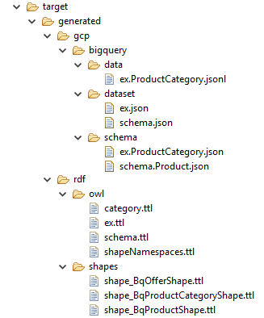
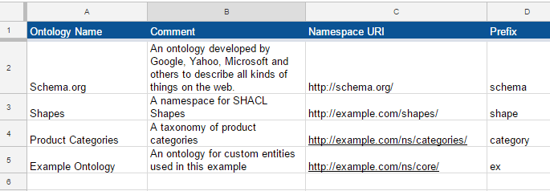
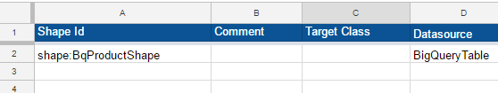
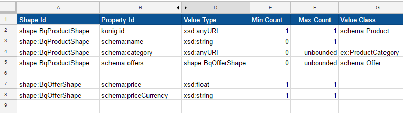
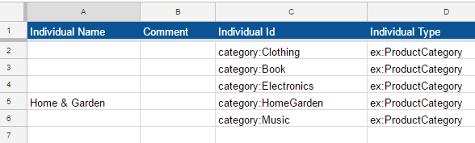

# bigquery-table

In this example, we show how you can can use the *Konig Schema Generator* to
generate BigQuery tables definitions for `Product` and `ProductCategory`
entities.

The `Product` table holds records like this one:

```
  {
    "id" : "http://example.com/products/49274803",
  	"name" : "iPhone 7S",
  	"category" : "Electronics",
  	"offers" : [{
  		"price" : 749.0,
  		"priceCurrency" : "USD"
  	}]
  }
```

The `ProductCategory` table holds records like this one:

```
	{
		"id" : "HomeGarden",
		"name" : "Home & Garden"
	}
```

The BigQuery table schemas are generated from a data model that is defined in  the
[bigquery-table.xlsx](src/bigquery-table.xlsx) workbook.
You can [view this workbook](https://docs.google.com/spreadsheets/d/15hh8U6EVx-zZTPAGC5WqDP2K3mrJRoaHMsssVDYQ0RE/edit?usp=sharing) online in Google Drive.

We'll have more to say about the data model workbook later.  But first, we'll
explain how to run the Maven build, and we'll summarize the artifacts that are
generated.

## The POM File

The BigQuery table schemas (and other artifacts) are produced by the *Konig Schema
Generator* Maven plugin.  This plugin is configured in the [pom.xml](pom.xml) file
for the project.  Here the configuration we are using:

```
<configuration>
  <defaults>
    <rootDir>${basedir}/target/generated</rootDir>
  </defaults>
  <workbook>
    <workbookFile>${basedir}/src/bigquery-table.xlsx</workbookFile>
  </workbook>
  <googleCloudPlatform>
    <enumShapeNameTemplate>http://example.com/shapes/Bq{targetClass.localName}Shape</enumShapeNameTemplate>
  </googleCloudPlatform>
</configuration>
```

The `rootDir` property tells the plugin where to store the generated artifacts.

The `workbookFile` property gives the location of the spreadsheet that describes the data model.

The `googleCloudPlatform` element tells the plugin to generate Google Cloud resources.

We'll explain the `enumShapeNameTemplate` later.

## Running the Maven build

Execute the following commands to run the Maven build.

```
git clone git@github.com:konigio/konig-examples.git
cd konig-examples/gcp/bigquery-table/
mvn install
```


## Output from the Maven Build

The Maven build process generates five different kinds
artifacts:

* BigQuery Dataset Definitions
* BigQuery Schema Definitions
* Reference Data
* OWL Ontologies
* SHACL Shapes

Here's a listing of the generated artifacts:



We discuss the generated artifacts in detail below.

## The Data Model workbook

The *Konig Schema Generator* produces artifacts based on a data model that is
defined in the
[bigquery-table.xlsx](src/bigquery-table.xlsx) workbook which
you can [view online](https://docs.google.com/spreadsheets/d/15hh8U6EVx-zZTPAGC5WqDP2K3mrJRoaHMsssVDYQ0RE/edit?usp=sharing) in Google Drive.

The workbook contains four tabs:
* Ontologies
* Shapes
* Property Constraints
* Individuals

We discuss the content of these tabs below.

### Ontologies


The Ontologies tab specifies four ontologies:

* `Schema.org`:  An ontology developed by Google, Yahoo, Microsoft, and others to describe all kinds of things on the web.  We use the `Product` and `Offer` classes from this ontology.

* `Shapes`: A custom ontology that contains our [SHACL Shape](https://www.w3.org/TR/shacl/) definitions.

* `Product Categories`: A taxonomy of product Categories

* `Example Ontology`:  A custom ontology that contains the definition of the `ProductCategory` class.

For each ontology, the workbook defines a `Namespace URI` and a `Namespace Prefix`.

### Shapes


There are three shapes in our example:

* `BqProductShape`
* `BqOfferShape`
* `BqProductCategoryShape`

The `Shapes` tab in a data model workbook allows you to declare shapes explicitly.

You should declare shapes explicitly if you want to:
* Provide a comment about the Shape. Comments appear in documentation artifacts.
* Associate the Shape with a Datasource
* Define an IRI template for resources that conform to the Shape.
* Declare attributes for an analytics pipeline.

In our example, we declare the `BqProductShape` explicitly because we want to
associate it with a BigQuery table. To that end, we specify `BigQueryTable` as
the `Datasource`.

The `BqOfferShape` is defined implicitly on the `Property Constraints` tab which
we discuss below.

The `BqProductCategoryShape` is generated based on the `enumShapeNameTemplate`
parameter in the POM file.

Recall that the POM file contains this configuration element:

```
<googleCloudPlatform>
	<enumShapeNameTemplate>http://example.com/shapes/Bq{targetClass.localName}Shape</enumShapeNameTemplate>
</googleCloudPlatform>
```
The `enumShapeNameTemplate` parameter tells the *Konig Schema Generator* plugin
to generate a SHACL shape for classes that
extend `schema:Enumeration`, and it should use the specified IRI template to produce
names (IRI values) for each such Shape.

In practice, this means that the plugin will generate a Shape
for each class in the `Individual Type` column of the `Individuals` tab.

Our example contains one such class: `ex:ProductCategory`.

Since `ProductCategory` is the local name of the target class, the IRI template
tells us that the generated Shape will be named:
```
  http://example.com/shapes/BqProductCategoryShape
```
### Property Constraints


The [Property Constraints](https://docs.google.com/spreadsheets/d/15hh8U6EVx-zZTPAGC5WqDP2K3mrJRoaHMsssVDYQ0RE/edit#gid=1522633637) tab declares the properties of the `Product` and `Offer` entities.

The `Value Type` column may specifies the type of value for each property. The
`Value Type` may be a simple datatype from the XML Schema specification (`xsd:string`,
`xsd:float`, etc.).  When designing a Shape, you need to decide how to handle object
properties.  For each object property you specify either an IRI reference or an embedded
record.

When an object property has an IRI reference as its value, as shown
in row 4 for the `schema:category` property, the `Value Type` should be set to
`xsd:anyURI`.  Use the `Value Class` column to specify the type of entity that is
being referenced by the IRI.  For the `schema:category` property, we specify that
values must reference an entity of type `ex:ProductCategory`.

When an object property has an embedded record as its value, the `Value Type`
column identifies the `Shape` of the embedded record.  In row 5, the `schema:offers`
property specifies `shape:BqOfferShape` as the `Value Type`.  The structure of
this embedded record is defined in rows 7-8.

### Individuals


Reference data elements are defined as *Named Individuals* within a semantic model.
Each possible value within a controlled vocabulary is assigned an IRI that serves
as a globally unique identifier for that value.  This allows us to treat the
individual value as a resource that can have properties such as a name or a comment
suitable for display in documentation.

The `Individual Id` column specifies the IRI for each Named Individual.  The
`Individual Name` column specifies a human-friendly name suitable for display in
a user interface.  By default, the human-friendly name is given by the local name
from the IRI, so you only need to specify the `Individual Name` if you want to
override the default.

## Generated Artifacts

### BigQuery Dataset Definitions

In a semantic model, classes, properties and reference data are organized into
ontologies.  Each ontology forms a namespace for the entities contained within
it.

By default, the *Konig Schema Generator* produces a separate BigQuery dataset
for each ontology.  The [data model](src/bigquery-table.xlsx)
workbook defines a custom ontology identified by the prefix `ex` for the `ProjectCategory`
class, and it uses the `Schema.org` ontology for the `Product` and `Offering` classes.  
The generator produces two dataset definitions corresponding to these ontologies.
They can be found in the folder at
```
target/generated/bigquery/dataset/
```
Here's a listing of the generated dataset definitions:
________________________________________________________________________________
File: `ex.json`
```json
{
  "datasetReference" : {
    "projectId" : "{gcpProjectId}",
    "datasetId" : "ex"
  }
}
```
________________________________________________________________________________
File: `schema.json`
```json
{
  "datasetReference" : {
    "projectId" : "{gcpProjectId}",
    "datasetId" : "schema"
  }
}
```
________________________________________________________________________________
These dataset definitions have a placeholder for the `projectId` attribute.  The
value of the `projectId` attribute is given as `{gcpProjectId}`.  Curly braces
indicate that the value is a variable. This practice
allows you to substitute different values for the `projectId` depending on the environment
you are working in.  You might have different `projectId` values for development, testing, and
production environments.  When you are ready to deploy the tables to a given environment, just
perform a search-and-replace operation on the `{gcpProjectId}` placeholder.

### BigQuery Schema Definitions

The generated BigQuery schemas can be found in the folder at:

```
  target/generated/bigquery/schema
```

Here's a listing of the files:

________________________________________________________________________________
File: `ex.ProductCategory.json`
```json
{
  "schema" : {
    "fields" : [ {
      "mode" : "REQUIRED",
      "name" : "id",
      "type" : "STRING"
    }, {
      "mode" : "NULLABLE",
      "name" : "name",
      "type" : "STRING"
    } ]
  },
  "tableReference" : {
    "datasetId" : "ex",
    "projectId" : "{gcpProjectId}",
    "tableId" : "ProductCategory"
  }
}
```
________________________________________________________________________________
File: `ex.ProductCategory.json`
```json
{
  "schema" : {
    "fields" : [ {
      "mode" : "REQUIRED",
      "name" : "id",
      "type" : "STRING"
    }, {
      "mode" : "NULLABLE",
      "name" : "name",
      "type" : "STRING"
    }, {
      "mode" : "REPEATED",
      "name" : "category",
      "type" : "STRING"
    }, {
      "fields" : [ {
        "mode" : "REQUIRED",
        "name" : "price",
        "type" : "FLOAT"
      }, {
        "mode" : "REQUIRED",
        "name" : "priceCurrency",
        "type" : "STRING"
      } ],
      "mode" : "REPEATED",
      "name" : "offers",
      "type" : "RECORD"
    } ]
  },
  "tableReference" : {
    "datasetId" : "schema",
    "projectId" : "{gcpProjectId}",
    "tableId" : "Product"
  }
}
```
________________________________________________________________________________

Like the dataset defintions, the BigQuery schema definitions contain a placeholder
for the `projectId` value.

### Reference Data
Reference data are data that define the set of permissible values for certain
fields.  In this example, the permissible values for the `category` field of a
`Product` are restricted to the following controlled vocabulary:

* `Clothing`
* `Book`
* `Electronics`
* `HomeGarden`
* `Music`

These values are stored in the `id` column of the `ex.ProductCategory` table.  The
`name` column gives a string suitable for display in a user interface.

By default, the `name` value is the same as the `id` value, but it can be different.
For instance, the `name`  for `HomeGarden` is "Home & Garden".

The *Konig Schema Generator* produces a [JSON lines](http://jsonlines.org/)
document that contains the data values for the `ProductCategory` table.  Each
line in the document is a JSON object representing one row in the table.

Files containing reference data can be found in the folder at:

```
target/generated/gcp/bigquery/data
```

Here's a listing of the generated file from this example.
________________________________________________________________________________
File: ex.ProductCategory.jsonl
```json
{"id":"Book","name":"Book"}
{"id":"Clothing","name":"Clothing"}
{"id":"Electronics","name":"Electronics"}
{"id":"HomeGarden","name":"Home & Garden"}
{"id":"Music","name":"Music"}
```
________________________________________________________________________________

### OWL Ontologies

The `Konig Schema Generator` produces an RDF document in [Turtle](https://www.w3.org/TR/turtle/)
syntax for each OWL Ontology contained in the data model workbook.

The generated files can be found in the folder at:
```
target/generated/rdf/owl/
```

Each RDF document describes the classes, properties and reference data
contained within the Ontology.

Here are the files generated from the data model workbook.
________________________________________________________________________________
File: category.ttl
```
@prefix category: <http://example.com/ns/categories/> .
@prefix ex: <http://example.com/ns/core/> .
@prefix owl: <http://www.w3.org/2002/07/owl#> .
@prefix rdfs: <http://www.w3.org/2000/01/rdf-schema#> .
@prefix schema: <http://schema.org/> .
@prefix vann: <http://purl.org/vocab/vann/> .

category: a owl:Ontology ;
	vann:preferredNamespacePrefix "category" ;
	rdfs:label "Product Categories" ;
	rdfs:comment "A taxonomy of product categories" .

category:Book a ex:ProductCategory ;
	schema:name "Book" .

category:Clothing a ex:ProductCategory ;
	schema:name "Clothing" .

category:Electronics a ex:ProductCategory ;
	schema:name "Electronics" .

category:HomeGarden a ex:ProductCategory ;
	schema:name "Home & Garden" .

category:Music a ex:ProductCategory ;
	schema:name "Music" .
```  
________________________________________________________________________________
File: ex.ttl
```
@prefix ex: <http://example.com/ns/core/> .
@prefix owl: <http://www.w3.org/2002/07/owl#> .
@prefix rdfs: <http://www.w3.org/2000/01/rdf-schema#> .
@prefix schema: <http://schema.org/> .
@prefix vann: <http://purl.org/vocab/vann/> .

ex: a owl:Ontology ;
	vann:preferredNamespacePrefix "ex" ;
	rdfs:label "Example Ontology" ;
	rdfs:comment "An ontology for custom entities used in this example" .

ex:ProductCategory a owl:Class ;
	rdfs:subClassOf schema:Enumeration .
```
________________________________________________________________________________
File: `schema.ttl`
```
@prefix ex: <http://example.com/ns/core/> .
@prefix owl: <http://www.w3.org/2002/07/owl#> .
@prefix rdfs: <http://www.w3.org/2000/01/rdf-schema#> .
@prefix schema: <http://schema.org/> .
@prefix vann: <http://purl.org/vocab/vann/> .
@prefix xsd: <http://www.w3.org/2001/XMLSchema#> .

schema: a owl:Ontology ;
	vann:preferredNamespacePrefix "schema" ;
	rdfs:label "Schema.org" ;
	rdfs:comment """An ontology developed by Google, Yahoo, Microsoft and others
     to describe all kinds of things on the web.""" .

schema:Offer a owl:Class .

schema:Product a owl:Class .

schema:category a owl:ObjectProperty ;
	schema:domainIncludes schema:Product ;
	schema:rangeIncludes ex:ProductCategory .

schema:name a owl:DatatypeProperty ;
	schema:domainIncludes schema:Product ;
	schema:rangeIncludes xsd:string .

schema:offers a owl:ObjectProperty ;
	schema:domainIncludes schema:Product ;
	schema:rangeIncludes schema:Offer .

schema:price a owl:DatatypeProperty ;
	schema:domainIncludes schema:Offer ;
	schema:rangeIncludes xsd:float .

schema:priceCurrency a owl:DatatypeProperty ;
	schema:domainIncludes schema:Offer ;
	schema:rangeIncludes xsd:string .
```
________________________________________________________________________________
File: `shape.ttl`
```
@prefix owl: <http://www.w3.org/2002/07/owl#> .
@prefix rdfs: <http://www.w3.org/2000/01/rdf-schema#> .
@prefix shape: <http://example.com/shapes/> .
@prefix vann: <http://purl.org/vocab/vann/> .

shape: a owl:Ontology ;
	vann:preferredNamespacePrefix "shape" ;
	rdfs:label "Shapes" ;
	rdfs:comment "A namespace for SHACL Shapes" .
```
________________________________________________________________________________  

The `shape.ttl` file merely declares the namespace for the SHACL shapes defined
in the data model workbook.  There is a separate file for each Shape, as we
discuss below.

### SHACL Shapes

The generated SHACL shape definitions can be found in the folder at:
```
target/generated/gcp/rdf/shapes
```
Here's a listing of the generated files:
________________________________________________________________________________
File: `shape_BqOfferShape.ttl`
```
@prefix owl: <http://www.w3.org/2002/07/owl#> .
@prefix schema: <http://schema.org/> .
@prefix sh: <http://www.w3.org/ns/shacl#> .
@prefix shape: <http://example.com/shapes/> .
@prefix xsd: <http://www.w3.org/2001/XMLSchema#> .

shape:BqOfferShape a sh:Shape ;
	sh:targetClass schema:Offer ;
	sh:property  [
		sh:predicate schema:price ;
		sh:datatype xsd:float ;
		sh:minCount 1 ;
		sh:maxCount 1
	 ]  ,  [
		sh:predicate schema:priceCurrency ;
		sh:datatype xsd:string ;
		sh:minCount 1 ;
		sh:maxCount 1 ]  .

schema:Offer a owl:Class .

schema:price a owl:DatatypeProperty ;
	schema:domainIncludes schema:Offer ;
	schema:rangeIncludes xsd:float .

schema:priceCurrency a owl:DatatypeProperty ;
	schema:domainIncludes schema:Offer ;
	schema:rangeIncludes xsd:string .
```
________________________________________________________________________________
File: `shape_BqProductCategoryShape.ttl`
```
@prefix ex: <http://example.com/ns/core/> .
@prefix gcp: <http://www.konig.io/ns/gcp/> .
@prefix konig: <http://www.konig.io/ns/core/> .
@prefix schema: <http://schema.org/> .
@prefix sh: <http://www.w3.org/ns/shacl#> .
@prefix shape: <http://example.com/shapes/> .
@prefix xsd: <http://www.w3.org/2001/XMLSchema#> .

shape:BqProductCategoryShape sh:property  [
		sh:predicate schema:name ;
		sh:datatype xsd:string ;
		sh:maxCount 1 ]  ;
	a sh:Shape ;
	sh:nodeKind sh:IRI ;
	sh:targetClass ex:ProductCategory ;
	konig:shapeDataSource  [
		gcp:tableReference  [
			gcp:projectId "{gcpProjectId}" ;
			gcp:datasetId "ex" ;
			gcp:tableId "ProductCategory" ]  ;
		a konig:GoogleBigQueryTable ]  .   
```
________________________________________________________________________________
File: `shape_BqProductShape.ttl`
```
@prefix as: <http://www.w3.org/ns/activitystreams#> .
@prefix ex: <http://example.com/ns/core/> .
@prefix gcp: <http://www.konig.io/ns/gcp/> .
@prefix konig: <http://www.konig.io/ns/core/> .
@prefix prov: <http://www.w3.org/ns/prov#> .
@prefix schema: <http://schema.org/> .
@prefix sh: <http://www.w3.org/ns/shacl#> .
@prefix shape: <http://example.com/shapes/> .
@prefix xsd: <http://www.w3.org/2001/XMLSchema#> .

shape:BqProductShape a sh:Shape ;
	prov:wasGeneratedBy <http://www.konig.io/activity/zx0ey5_9of0AAAFbyVm9yA> ;
	sh:nodeKind sh:IRI ;
	sh:targetClass schema:Product ;
	sh:property  [
		sh:predicate schema:name ;
		sh:datatype xsd:string ;
		sh:minCount 0 ;
		sh:maxCount 1
	 ]  ,  [
		sh:predicate schema:category ;
		sh:class ex:ProductCategory ;
		sh:nodeKind sh:IRI ;
		sh:minCount 0
	 ]  ,  [
		sh:predicate schema:offers ;
		sh:shape shape:BqOfferShape ;
		sh:minCount 0 ;
		sh:maxCount 1 ]  ;
	konig:shapeDataSource <https://www.googleapis.com/bigquery/v2/projects/{gcpProjectId}/datasets/schema/tables/Product> .

<http://www.konig.io/activity/zx0ey5_9of0AAAFbyVm9yA> a konig:LoadModelFromSpreadsheet ;
	as:endTime "2017-05-02T09:29:13.519-04:00"^^xsd:dateTime .

<https://www.googleapis.com/bigquery/v2/projects/{gcpProjectId}/datasets/schema/tables/Product> a konig:GoogleBigQueryTable , konig:DataSource ;
	gcp:tableReference  [
		gcp:projectId "{gcpProjectId}" ;
		gcp:datasetId "schema" ;
		gcp:tableId "Product" ]  .
```    
________________________________________________________________________________
