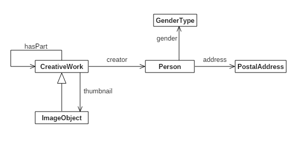

# Multi-Project Example

This example shows how to use a master Maven project to generate a suite of projects
based on a given semantic model and some configuration parameters.

The suite of child projects lets you manage different aspects of the overall project
separately.  Here's a list of the child projects that will be generated:

- demo-appengine
- demo-data-catalog
- demo-gcp-deploy
- demo-gcp-model
- demo-java-model
- demo-rdf-model

In addition there is a parent project that ties them all together...

- demo-parent

We discuss these projects in more detail below.

## The Semantic Model

Here's a UML diagram that shows the classes in this example:



The semantic model is defined in the [multi-project](https://drive.google.com/open?id=1VXdqWLCwmfJAv-XeSAh1g2F6ZvwOIhq5updcJnzEZdQ) 
spreadsheet in Google Drive, and which can be found at [src/multi-project.xlsx](src/multi-project.xlsx).

## The Master POM

The Master POM is a Maven POM file that controls the generation of the child project.
You can find it at [pom.xml](pom.xml).

The key element of this POM file is the Konig Schema generator plugin, which is configured as follows:

```
<plugin>
	<groupId>io.konig</groupId>
	<artifactId>konig-schemagen-maven-plugin</artifactId>
	<version>${konig.version}</version>
	<configuration>
		<multiProject>
		
			<baseDir>${basedir}/../demo</baseDir>
			<groupId>com.example</groupId>
			<artifactId>demo</artifactId>
			<version>1.0.0</version>
			<name>Demo</name>
			<konigVersion>${konig.version}</konigVersion>
			
			<workbook>
				<workbookFile>${basedir}/src/multi-project.xlsx</workbookFile>
			</workbook>
			<java>
				<filter>
					<exclude>
						<namespaces>
							<namespace>http://example.com/ns/alias/</namespace>
						</namespaces>
					</exclude>
				</filter>
			</java>
			<googleCloudPlatform>
				<dataServices/>
			</googleCloudPlatform>
			<dataCatalog>
				<contentSystem>
					<baseURL>https://pearson-docs.appspot.com/content/</baseURL>
					<bundleName>demo</bundleName>
					<bundleVersion>1.0.0</bundleVersion>
				</contentSystem>
			</dataCatalog>
		</multiProject>
	</configuration>
	<executions>
		<execution>
			<phase>generate-sources</phase>
			<goals>
				<goal>generate</goal>
			</goals>
		</execution>
	</executions>
</plugin>
```