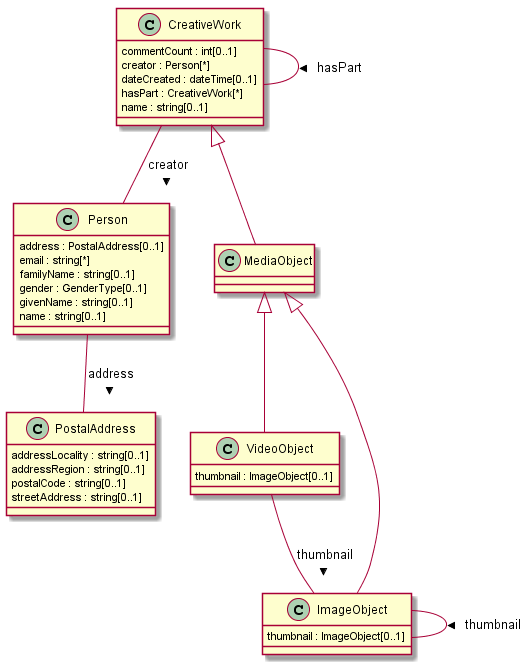
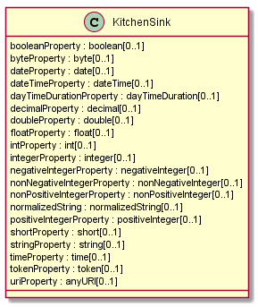

# JSON-IO model

This project generates JavaBeans plus JSON readers and
writers for the beans.

The JavaBeans are derived from a semantic model for the classes shown in the following
UML Class Diagram.



In addition, we generate source code for the  `KitchenSink` class shown below.
  

This
class is contrived to have all the supported datatypes from [XML Schema](https://www.w3.org/TR/xmlschema-2/#built-in-datatypes).

The Maven POM file contains the following plugin configuration:

```
<plugin>
	  		<groupId>io.konig</groupId>
	  		<artifactId>konig-schemagen-maven-plugin</artifactId>
	  		<version>${konig.version}</version>
	  		<configuration>
	  			<workbookProcessor>
		  			<workbookFile>${basedir}/src/json-io.xlsx</workbookFile>
		  			<owlOutDir>${basedir}/target/generated/src/rdf/owl</owlOutDir>
		  			<shapesOutDir>${basedir}/target/generated/src/rdf/shapes</shapesOutDir>
	  			</workbookProcessor>
	  			<rdfSourceDir>${basedir}/target/generated/src/rdf</rdfSourceDir>
	  			<javaCodeGenerator>
	  				<javaDir>${basedir}/target/generated/src/main/java</javaDir>
		  			<packageRoot>com.example</packageRoot>
		  			<generateCanonicalJsonReaders>true</generateCanonicalJsonReaders>
	  			</javaCodeGenerator>
	  		</configuration>
	  		<executions>
	  			<execution>
		  			<phase>generate-sources</phase>
		  			<goals>
		  				<goal>generate</goal>
		  			</goals>
	  			</execution>
	  		</executions>
  		</plugin>
```      

The semantic model is described in a workbook specified by the `workbookFile`
parameter.  You can [view the workbook](https://docs.google.com/spreadsheets/d/1kZm6_pKPVB1wA5lVfYK8oT-TJBNhRAlHFoyDZ3IXOx0/edit?usp=sharing) in Google Drive.

OWL ontologies contained in the workbook are saved to the directory
specified by the `owlOutDir` parameter.  SHACL shapes contained in the workbook
are saved to the directory specified by the `shapesOutDir` parameter.

The OWL ontologies and SHACL Shapes serve as input to the Java Code Generator.
The `rdfSourceDir` parameter tells the code generator where to find the OWL ontologies
and SHACL shapes.  It searches the directory tree recursively for Turtle files
which end with the `.ttl` suffix.

Here's a complete list of the configuration parameters for the Java Code Generator.

| Parameter Name | Description                                                 |
|----------------|-------------------------------------------------------------|
| `javaDir`        | The output directory for generated Java source code.        |
| `packageRoot`    | The root Java packages.  All generated Java source code will be nested beneath this package.  This value would typically be set to something like `com.your_company_name` |
| `generateCanonicalJsonReaders` | A boolean value that specifies whether a canonical JSON reader should be generated for each OWL class |
| `googleDatastoreDaoPackage` | The root package containing all Data Access Objects for accessing data from Google Datastore |

To run this example, open a command shell in the folder that contains this README file
and issue the following command:

```
mvn clean install
```

You will find generated source code in the directory at `target/generated/src/main/java`.

Here's a summary of the packages produced:

| Package                 |  Contains                                          |
|-------------------------|----------------------------------------------------|
| `com.example.model`     | Interfaces for the Plain-Old Java Objects.         |
| `com.example.impl`      | Implementation classes for the POJOs               |
| `com.example.io.reader` | JSON Reader implementations                        |
| `com.example.io.writer` | JSON Writer implementations                        |

These packages contain sub-packages for each namespace declared in the workbook.

There is an important difference in the nature of the JSON Readers and Writers.
Each Writer produces JSON documents to conform to a specific Shape.  So there is
one Writer per shape.  By constrast, there is a single, canonical reader for each
OWL class. The same reader will work for any Shape of data provided it follows
these rules:

1. Field names are identical to the local name of some RDF property declared in the semantic model
2. Fields corresponding to an owl:ObjectProperty  IRI reference (rendered as a string) as the value, or an embedded JSON object.  IRI references may be fully-qualified, or a CURIE using the preferred namespace prefix, or in the case of an enumerated value, the local name of the individual.
3. Numeric fields have numeric values (not strings).
4. Boolean fields have Boolean literals (`true` or `false`) for values.
5. Other datatype fields are represented as strings that conform to the lexical space of the associated XML Schema Datatype.
