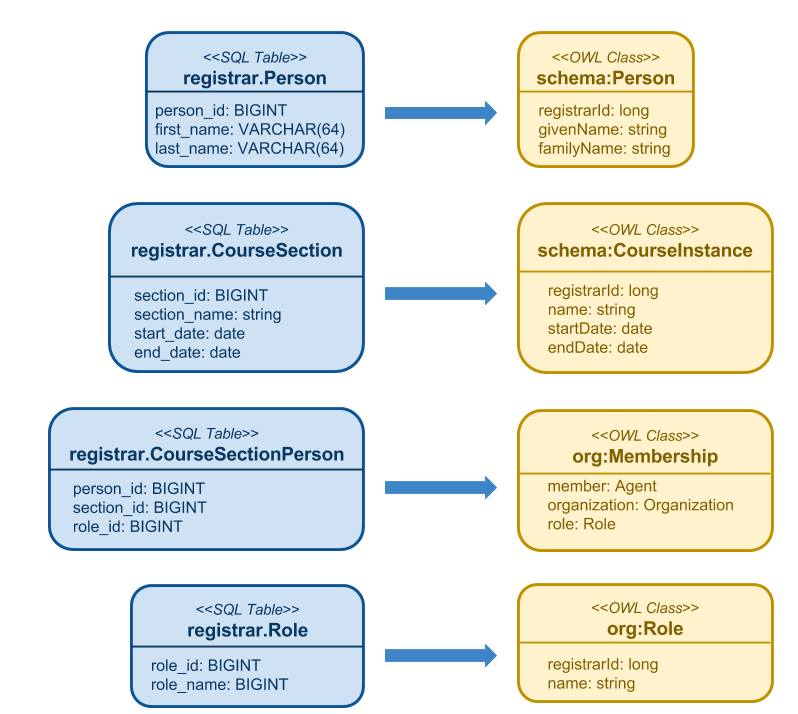

# SQL Shapes
This example shows how to generate SHACL Shapes for a collection of SQL Tables.

The entities in this example include:

- *Person*
- *Course Section*
- *Role*
- *Membership*

where the *Membership* entity is an association class which specifies that some
*Person* is a member of some *Course Section* with a certain *Role*
(`Instructor` or `Learner`).

For each entity, we generate two different kinds of shapes: (1) to represent the
entity at rest in the RDBMS, and (2) to represent the entity in flight.

We start with a SQL Table definition for each entity and map those entities to
OWL classes as shown in the following diagram:



Notice that the names for classes and properties can be different in the RDBMS
model and the semantic model.

In another example, we'll show how to generate code that transforms from one
data shape to another.

# Prerequisites
Make sure you have installed Maven and Git.  See [Getting Started](../README.md#GetStarted) for details.

You should have a basic understanding of RDF, SHACL Data Shapes, and the Turtle
serialization format as discussed in the following articles:
   * [RDF in a nutshell](http://developers.konig.io/docs/RDF_in_a_nutshell/)
   * [SHACL Basics](http://kcoyle.blogspot.com/2015/10/shacl-shapes-constraint-language.html)
   * [Graph Serialization](http://developers.konig.io/docs/Graph_Serialization/)

# Procedure

The procedure consists of the following steps:

1. Add semantic markup to the 
2. Create a Maven POM that will transform SQL into a SHACL Shape
3. Run the Maven build

We discuss these steps in detail below.

## Save SQL Table definitions

Save your SQL Table definitions to a file (or a collection of files).
As a best practice, these files should be placed in the following directory
(relative to the root of your Maven project):

```
    src/sql
```

Table definitions must be expressed in
[SQL-2003 CREATE TABLE](http://savage.net.au/SQL/sql-2003-2.bnf.html#table definition)
syntax.

More precisely, you need to use a subset of SQL-2003.  Only the following kinds of
constraints are supported:

* NOT NULL
* UNIQUE
* PRIMARY KEY
* FOREIGN KEY

A table that contains a `PRIMARY KEY` constraint will be mapped
to a Shape whose `sh:nodeKind` is `sh:IRI`.  This implies that every instance of
the associated class must be identified by an IRI.
If you don't want this result, simply remove the `PRIMARY KEY` constraint from
the table definition.

The SQL file names must end with the ".sql" suffix.

In this example, our table definitions are contained in the file [`src/sql/registrar.sql`](src/sql/registrar.sql)
